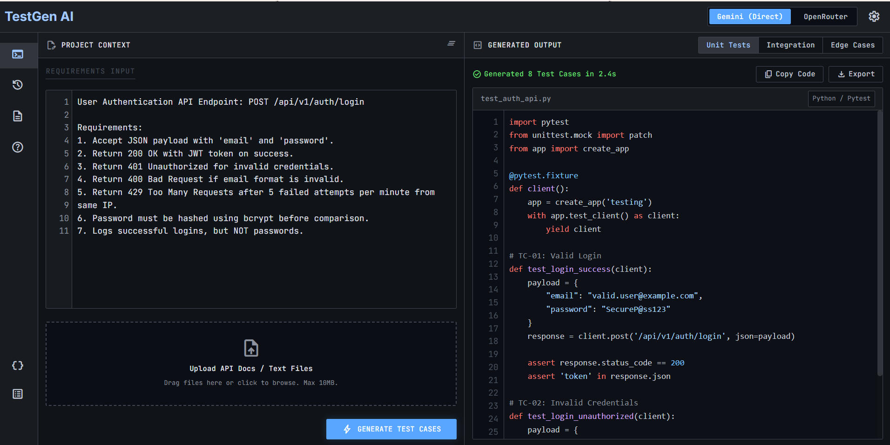

# TestGen AI

TestGen AI is a FastAPI-powered developer dashboard that turns API requirements, user stories, and acceptance criteria into clean Python Pytest test code.



## Team Binary

- Jyotasana
- Anand Minejes

## Features

- Generate Pytest test cases from natural language project context.
- Switch between direct Google Gemini and OpenRouter models.
- Use current OpenRouter free model IDs, with a backend fallback when a stale model slug is submitted.
- Upload `.txt`, `.json`, `.md`, `.yaml`, or `.yml` files into the requirements editor.
- Copy generated code to the clipboard or export it as a `.py` file.
- Mask API keys in provider error messages before returning them to the UI.

## Tech Stack

- Backend: FastAPI, Python ASGI
- Frontend: HTML, vanilla JavaScript, Tailwind CSS CDN, Material Symbols
- Deployment: Vercel Python runtime using the root `app.py` entrypoint

## Project Structure

```text
.
|-- app.py                  # FastAPI entrypoint used by Vercel and local dev
|-- ai_service.py           # Gemini/OpenRouter provider logic
|-- requirements.txt        # Runtime Python dependencies
|-- api/templates/          # Static HTML dashboard pages
|-- assets/                 # README/dashboard assets
`-- .env.example            # Environment variable template
```

## Local Setup

1. Install dependencies:

   ```bash
   pip install -r requirements.txt
   ```

2. Create a `.env` file in the project root:

   ```env
   GEMINI_API_KEY=your_gemini_key
   OPENROUTER_API_KEY=your_openrouter_key
   ```

3. Start the local server:

   ```bash
   python -m uvicorn app:app --host 127.0.0.1 --port 8000 --reload
   ```

4. Open:

   ```text
   http://127.0.0.1:8000
   ```

## Vercel Deployment

This project uses Vercel's FastAPI zero-config path. The root `app.py` file exposes the FastAPI instance as `app`, so no `vercel.json` is required.

1. Push the repository to GitHub.
2. Import the repository in Vercel.
3. Add environment variables in Vercel Project Settings:
   - `GEMINI_API_KEY`
   - `OPENROUTER_API_KEY`
4. Deploy.

After deployment, hard refresh the site if the browser still shows an old OpenRouter model in the dropdown.

## API

### `GET /`

Serves the main dashboard.

### `GET /code`

Serves the alternate generated-code page.

### `POST /api/generate`

Generates Pytest code.

Request body:

```json
{
  "project_context": "Describe the API or feature to test",
  "model_choice": "gemini",
  "model_name": "",
  "test_type": "unit"
}
```

Supported values:

- `model_choice`: `gemini`, `openrouter`
- `test_type`: `unit`, `integration`, `edge`

Response body:

```json
{
  "code": "def test_example():\n    assert True",
  "elapsed": 1.23,
  "test_count": 1
}
```

## Notes

- `.env` files are ignored by Git.
- `.env.example` is intentionally tracked as a template.
- If OpenRouter removes a model ID, the backend falls back to `qwen/qwen3-coder:free`.
