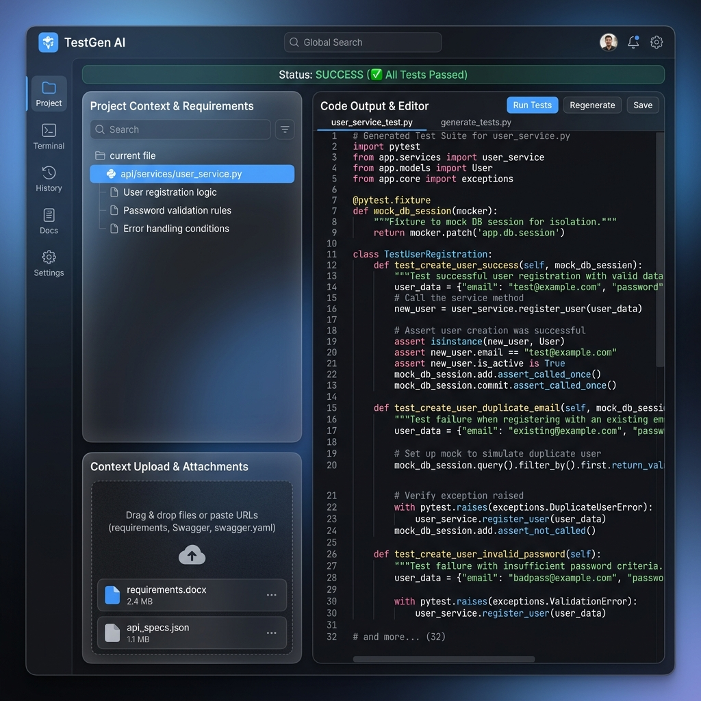

# TestGen AI ⚡

TestGen AI is a premium, high-density developer dashboard engineered to automatically transform natural language API specifications, user stories, and acceptance criteria into clean, runnable Python Pytest source code.



---

## 👥 Team: **Binary**
* **Jyotasana**
* **Anand Minejes**

---

## ✨ Features
1. **Multi-Model Intelligence**: Toggles seamlessly between direct **Google Gemini (using Gemini 2.5 Flash)** and **OpenRouter** (offering over 25+ free, speed-optimized, code-specialist, and reasoning-heavy LLMs).
2. **Interactive SideNavBar Multi-View Panel**:
   * **Workspace**: Project context input and requirement editor.
   * **History**: Interactive run history listing past generated specifications with clicking capabilities to reload.
   * **Prompts**: Toggle custom frameworks styles (Pytest with Mock, standard Unittest, or Pytest BDD).
   * **Docs**: Interactive helper reference formatting instructions and environment setup guidelines.
   * **Terminal**: Direct simulation console showing local ASGI endpoint hits and status logs.
   * **Logs**: Detailed execution log tracker.
3. **Advanced File Upload**: Supports clicking the drag-and-drop zone to launch a native OS file dialog or dragging files directly to load requirements in real-time.
4. **Key Obfuscation & Security**: Exception stack traces automatically sanitize and mask API keys (`AIzaSy***` and `Bearer sk-or-v1-***`) to prevent credentials exposure.
5. **Git Safety**: Upgraded exclusions ensuring `.env` files are never tracked or committed.
6. **Code Actions**: Clipboard copy helper and instant `.py` export actions.

---

## 🛠️ Tech Stack
* **Backend**: FastAPI (Python ASGI)
* **Frontend**: HTML5, Vanilla JavaScript, Vanilla CSS, Tailwind CSS utilities, Material Icons
* **Hosting Configuration**: Native Vercel Python Builder compatibility (`vercel.json`)

---

## 🚀 Local Setup & Verification

1. **Clone the repository**:
   ```bash
   git clone <repository_url>
   cd TestGen-AI
   ```

2. **Install dependencies**:
   ```bash
   pip install -r requirements.txt
   ```

3. **Configure Environment variables**:
   Create a `.env` file in the root directory:
   ```env
   GEMINI_API_KEY=AIzaSy...
   OPENROUTER_API_KEY=sk-or-v1-...
   ```

4. **Launch the development server**:
   ```bash
   python -m uvicorn main:app --host 127.0.0.1 --port 8000 --reload
   ```
   Open `http://127.0.0.1:8000` in your web browser.

---

## ☁️ Vercel Deployment

TestGen AI is ready for serverless deployment on Vercel:
1. Link your repository in the Vercel Dashboard.
2. In the project Settings, define your `GEMINI_API_KEY` and `OPENROUTER_API_KEY` environment variables.
3. Deploy! Vercel's `@vercel/python` builder will automatically set up the FastAPI endpoints and serve the static layouts.
